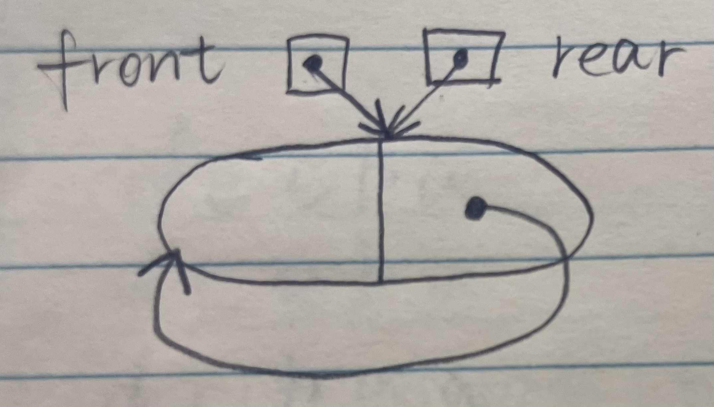
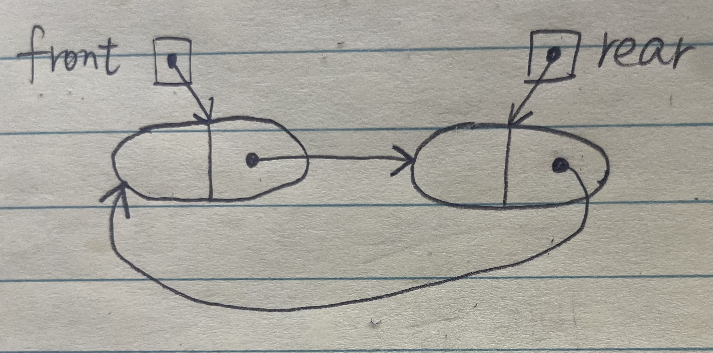

|      |                | Description                                          |
| ---- | -------------- | ---------------------------------------------------- |
| 3    | 栈、队列和数组 | 栈<br />队列<br />栈和队列的应用<br />数组和特殊矩阵 |

3. 栈的初态和终态均为空，以I和O分别表示入栈和出栈，则出入栈的操作序列可表示为由I和O组成的序列，可以操作的序列称为合法序列，否则称为非法序列。写出一个算法，判定所给的操作序列是否合法。若合法，返回true，否则返回false（假定被判定的操作序列已存入一维数组中）。

   算法思想：依次逐一扫描入栈出栈序列（即由“I”和“O”组成的字符串），每扫描至任一一个位置均需检查出栈次数（即“O”的个数）是否小于入栈个数（“I“的个数），若大于则为非法序列。扫描结束后，再判断入栈和出栈次数是否相等，若不相等则为非法序列。

   ```cpp
   bool Judge(char A[])
   {
       int i=0;
       int j=0,k=0;//i为下标，j和k分别为字母I和O的个数
       while(A[i]!='\0')//未到字符数组尾
       {
           switch(A[i])
           {
               case 'I': j++;break;//入栈次数增1
               case 'O':k++;
               if(k>j)
               {
                   printf("序列非法\n");
                   return false;
               }
           }
           i++;//不论A[i]是I还是O，指针i均后移
       }
       if(j!=k)
       {
           printf("序列非法\n");
           return false;
       }
       else
       {
           printf("序列合法\n");
           return true;
       }
   }
   ```

4. 设单链表的表头指针为L，结点结构由data和next两个域构成，其中data域为字符型。试设计算法判断该链表的全部n个字符是否中心对称。例如xyx，xyyx都是中心对称。

   算法思想：使用栈来判断链表中的数据是否中心对称。让链表的前一半元素依次进栈。在处理链表的后一半元素时，当访问到链表的一个元素后，就从栈中弹出一个元素，两个元素比较，若相等，则将链表中的下一个元素与栈中再弹出的元素比较，直至链表到尾。这时若栈是空栈，则得出链表中心对称的理论；否则，当链表中的一个元素与栈中弹出元素不等时，结论为链表非中心对称，结束算法的执行。

   ```cpp
   int dc(LinkList L, int n)
   {
       int i;
       char s[n/2];//s字符栈
       LNode *p = L->next;//工作指针p，指向待处理的当前元素
       for(i=0;i<n/2;i++)
       {
           s[i]=p->data;
           p=p->next;
       }
       i--;//恢复最后的i值
       if(n%2==1)//若n是奇数，后移过中心结点
           p=p->next;
       while(p!=NULL&&s[i]==p->data)//检测是否中心对称
       {
           i--;//i充当栈顶指针
           p=p->next;
       }
       if(i==-1)//栈为空栈
           return 1;//链表中心对称
       else
           return 0;//链表不中心对称
   }
   ```

   

5. 设有两个栈S1、S2都采用顺序栈方式，并共享一个存储区[0, ..., maxsize-1]，为了尽量利用空间，减少溢出的可能，可采用栈顶相向、迎面增长的存储方式。试设计S1、S2有关入栈和出栈的操作算法。

   两个栈共享向量空间，将两个栈的栈底设在向量两端，初始时，S1栈顶指针为-1，S2栈顶指针为maxsize。两个栈顶指针相邻时为栈满。两个栈顶相向、迎面增长，栈顶指针指向栈顶元素。两个栈入栈和退栈时的栈顶指针的计算。S1栈是通常意义下的栈；而S2栈入栈操作时，其栈顶指针左移（减1），退栈时，栈顶指针右移（加1）。对于所有栈的操作，都要注意”入栈判满、出栈判空“的检查。

   ```cpp
   #define maxsize 100//两个栈共享顺序存储空间所能达到的最多元素数
   #define elemtp int//假设元素类型为整型
   typedef struct{
       elemtp stack[maxsize];//栈空间
       int top[2];//top为两个栈顶指针
   }stk;
   stk s;//s是如上定义的结构类型变量，为全局变量
   
   int push(int i, elemtp x)
   {
   	//入栈操作。i为栈号，i=0表示左边的S1栈，i=1表示右边的S2栈，x是入栈元素
       //入栈成功返回1，否则返回0
       if(i<0||i>1)
       {
           printf("栈号输入不对");
           return -1;
       }
       if(s.top[1]-s.top[0]==1)
       {
           printf("栈已满\n");
           return 0;
       }
       switch(i)
       {
           case 0: s.stack[++s.top[0]]=x; return 1; break;
           case 1: s.stack[--s.top[1]]=x; return 1;
       }
   }
   //退栈操作
   elemtp pop(int i)
   {
       //退栈算法。i代表栈号，i=0表示左边的S1栈，i=1表示右边的S2栈
       //退栈成功返回退栈元素，否则返回-1
       if(i<0||i>1)
       {
           printf("栈号输入不对");
           return -1;
       }
       switch(i)
       {
           case 0:
               if(s.top[0]==-1)
               {
                   printf("栈空\n");
                   return -1;
               }
               else
                   return s.stack[s.top[0]--];
               break;
           case 1:
               if(s.top[1]==maxsize)
               {
                   printf("栈空\n");
                   return -1;
               }
               else
                   return s.stack[s.top[1]++];
               break;
       }
   }
   ```

   1. 若希望循环队列中的元素都能得到利用，则需设置一个标志域tag，并以tag的值为0或1来区分队头指针front和队尾指针rear相同时的队列状态是“空”还是“满”。试编写与此结构相应的入队和出队算法。
   
      在循环队列的类型结构中，增设一个tag的整型变量，进队时置tag为1，出队时置tag为0（因为只有入队操作可能导致队满，也只有出队操作可能导致队空）。队列Q初始时，置tag=0、front=rear=0。这样队列的4要素如下：
   
      队列条件：Q.front==Q.rear且Q.tag=0
   
      队满条件：Q.front==Q.rear且Q.tag=1
   
      进队操作：Q.data[Q.rear]=x; Q.rear=(Q.rear+1)%MaxSize; Q.tag=1
   
      出队操作：x=Q.data[Q.front]; Q.front=(Q.front+1)%MaxSize; Q.tag=0
   
      ```cpp
      //设“tag”法的循环队列入队算法
      int EnQueue1(SqQueue &Q, ElemType x)
      {
          if(Q.front==Q.rear&&Q.tag==1)
              return 0;//两个条件都满足时则队满
          Q.data[Q.rear]=x;
          Q.rear=(Q.rear+1)%MaxSize;
          Q.tag=1;//可能队满
          return 1;
      }
      //设“tag”法的循环队列出队算法
      int DeQueue1(SqQueue &Q, ElemType &x)
      {
          if(Q.front==Q.rear&&Q.tag==0)
              return 0;//两个条件都满足时则队空
          x=Q.data[Q.front];
          Q.front=(Q.front+1)%MaxSize;
          Q.tag=0;//可能队空
          return 1;
      }
      ```
   
   2. Q是一个队列，S是一个空栈，实现将队列中的元素逆置的算法。
   
      可以让队列中的元素逐个地出队列，入栈；全部入栈后再逐个出栈，入队列。
   
      ```cpp
      void Inverser(Stack &S, Queue &Q)
      {
          //本算法实现将队列中地元素逆置
          while(!QueueEmpty(Q))
          {
              x=DeQueue(Q);//队列中全部元素依次出队
              Push(S,x);//元素依次入栈
          }
          while(!StackEmpty(S))
          {
              Pop(S,x);//栈中全部元素依次出栈
              EnQueue(Q,x);//再入队
          }
      }
      ```
   
   3. 利用两个栈S1和S2来模拟一个队列，已知栈的4个运算定义如下：
   
      ```cpp
      Push(S, x);//元素x入栈S
      Pop(S, x);//S出栈将出栈的值赋给x
      StackEmpty(S);//判断栈是否为空
      StackOverflow(S);//判断栈是否满
      ```
   
      如何利用 栈的运算来实现该队列的3个运算
   
      ```cpp
      Enqueue;//将元素x入队
      Dequeue;//出队，并将出队元素存储在x中
      QueueEmpty;//判断队列是否为空
      ```
   
      利用两个栈S1和S2来模拟一个队列，当需要向队列中插入一个元素时，用S1来存放已输入的元素，即S1执行入栈操作。当需要出队时，则对S2执行出栈操作。因为从栈中取出元素的顺序是原顺序的的逆序，所以必须先将S1中的元素全部出栈并入栈到S2中，再在S2中执行出栈操作，即可实现出队操作，而在执行此操作前必须判断S2是否为空，否则会导致顺序混乱。当栈S1和S2都为空时队列为空。
   
      - 对S2的出栈操作用做出队，若S2为空，则先将S1中的所有元素送入S2
      - 对S1的入栈操作用做入队，若S1满，必须先保证S2为空，才能将S1中的元素全部插入S2中
   
      ```cpp
      //入队算法
      int EnQueue(Stack &S1, Stack &S2, ElemType e)
      {
          if(!StackOverflow(S1))
          {
              Push(S1,e);
              return 1;
          }
          if(StackOverflow(S1)&&!StackEmpty(S2))
          {
              printf("队列满");
              return 0;
          }
          if(StackOverflow(S1)&&StackEmpty(S2))
          {
              while(!StackEmpty(S1))
              {
                  Pop(S1,x);
                  Push(S2,x);
              }
          }
          Push(S1,e);
          return 1;
      }
      //出队算法
      void DeQueue(Stack &S1, Stack &S2, ElemType &x)
      {
          if(!StackEmpty(S2))
          {
              Pop(S2,x);
          }
          else if(StackEmpty(S1))
          {
              printf("队列为空");
          }
          else
          {
              while(!StackEmpty(S1))
              {
                  Pop(S1,x);
                  Push(S2,x);
              }
              Pop(S2,x);
          }
      }
      //判断队列为空的算法
      int QueueEmpty(Stack S1, Stack S2)
      {
          if(StackEmpty(S1)&&StackEmpty(S2))
              return 1;
          else
              return 0;
      }
      ```
   
   4. 请设计一个队列，要求满足：①初始时队列为空；②入队时，允许增加队列占用空间；③出队后，出队元素所占用的空间可重复使用，即整个队列所占用的空间只增不减；④入队操作和出队操作的时间复杂度始终保持为O(1)。请回答：
   
      - 该队列是应选择链式存储结构，还是应选择顺序存储结构？
      - 画出队列的初始状态，并给出判断队空和队满的条件
      - 画出第一个元素入队后的队列状态
      - 给出入队操作和出队操作的基本过程。
   
      顺序存储无法满足要求②的队列占用空间随着入队操作而增加。根据要求来分析：要求①容易满足；链式存储方便开辟新空间，要求②容易满足；对于要求③，出队后的结点并不真正释放，用队头指针指向新的队头结点，新元素入队时，有空余结点则无需开辟新空间，赋值到队尾后的第一个空结点即可，然后用队尾指针指向新的队尾结点，这就需要设计成一个首尾相接的循环单链表，类似于循环队列的思想。设置队头、队尾指针后，链式队列的入队操作和出队操作的时间复杂度均为O(1)，要求④可以满足。因此，采用链式存储结构（两段式单向循环链表），队头指针为front，队尾指针为rear。
   
      该循环链式队列的实现可以参考循环队列，不同之处在于循环链式队列可以方便地增加空间，出队的结点可以循环利用，入队时空间不够也可以动态增加。同样，循环链式队列也要区分队满和队空的情况，这里参考循环队列牺牲一个单元来判断。初始时，创建一个空闲结点的循环单链表，头指针front和尾指针rear均指向空闲结点。
   
      
   
      队空的判定条件：front==rear
   
      队满的判定条件：front==rear->next
   
      插入第一个元素后的状态
   
      
   
      - 入队操作
   
        ```cpp
        //若(front==rear->next)//队满
        	//则在rear后面插入一个新的空闲结点;
        //入队元素保存到rear所指结点中;rear=rear->next;返回。
        ```
   
      - 出队操作
   
        ```cpp
        //若(front==rear)//队空
        	//则出队失败，返回;
        //取front所指结点中的元素e;front=front->next;返回e。
        ```
   
      
      斐波那契数列
      
      ```cpp
      //递归
      int Fibonacci_recursion(int n)
      {
          if(n<=0)return 0;
          if(n==1)return 1;
          return Fibonacci_recursion(n-1)+Fibonacci_recursion(n-2);
      }
      //非递归，循环
      int Fibonacci_loop(int n)
      {
          int *a = new int[n]{1,1};//a[0]=a[1]=1,a[n-1]是第n个元素
          for(int i=2;i<n;i++)
              a[i]=a[i-1]+a[i-2];
          return a[n-1];
      }
      ```
      
      假设一个算术表达式中包含圆括号、方括号和花括号3中类型的括号，编写一个算法来判别表达式中的括号是否配对，以字符"\0"作为算术表达式的结束符。
      
      算法的基本思想是扫描每个字符，遇到花、中、圆的左括号时进栈，遇到花、中、圆的右括号时检查栈顶元素是否为相应的左括号，若是，退栈，否则配对错误。最后栈若不为空也为错误。
      
      ```cpp
      bool BracketsCheck(char *str)
      {
          InitStack(S);//初始化栈
          int i=0;
          while(str[i]!='\0')
          {
              switch(str[i])
              {
                  //左括号入栈
                  case '(':Push(S,'(');break;
                  case '[':Push(S,'[');break;
                  case '{':Push(S,']');break;
                  //遇到右括号，检测栈顶
                  case ')':Pop(S,e);
                      if(e!='(')return false;
                      break;
                  case ']':
                      if(e!='[')return false;
                      break;
                  case '}':
                      if(e!='{')return false;
                      break;
                  default:
                      break;
              }
              i++;
          }
          if(!isEmpty(S))
          {
              printf("括号不匹配\n");
              return false;
          }
          else
          {
              printf("括号匹配\n");
              return true;
          }
      }
      ```
      
      中缀转后缀
      
      ```cpp
      void Infix2Suffix(SqStack *S, ElemType str[])
      {
          int i=0;
          ElemType e;
          InitStack(s);
          while(str[i]!='\0')
          {
              while(isdigit(str[i]))//遇到数字直接输出，直到下一位不是数字字符，打印空格跳出循环
              {
                  printf("%c",str[i++]);
                  if(!isdigit(str[i]))
                  {
                      printf(" ");
                  }
              }
              /*
              加减运算符优先级最低，如果栈顶元素为空则直接入栈，否则将栈中存储的运算符全部弹栈，
              如果遇到左括号则停止，将弹出的左括号重新压栈，因为左括号要和右括号匹配时弹出。
              弹出后将优先级低的运算符压入栈中。
              */
              if(str[i]=='+'||str[i]=='-')
              {
                  if(!StackLength(S))
                  {
                      PushStack(S,str[i]);
                  }
                  else
                  {
                      do
                      {
                          PopStack(S,&e);
                          if(e=='(')
                          {
                              PushStack(S,e);
                          }
                          else
                          {
                              printf("%c",e);
                          }
                      }while(StackLength(S)&&e!='(');
                      PushStack(S,str[i]);
                  }
              }
              /*
              当遇到右括号时，把栈中运算符弹出，直到匹配到左括号为止
              右括号不压栈，左括号只弹出不打印
              */
              else if(str[i]==')')
              {
                  PopStack(S,&e);
                  while(e!='(')
                  {
                      printf("%c ",e);
                      PopStack(S,&e);
                  }
              }
              //乘、除、左括号都是优先级高的，直接压栈
              else if(str[i]=='*'||str[i]=='/'||str[i]=='(')
              {
                  PushStack(S,str[i]);
              }
              else if(str[i]=='\0')
              {
                  break;
              }
              else
              {
                  printf("输入格式错误\n");
                  return;
              }
              i++;
              //最后把栈中剩余运算符依次弹栈打印
              while(StackLength(S))
              {
                  PopStack(S,&e);
                  printf("%c ",e);
              }
          }
      }
      ```
      
      后缀表达式计算
      
      ```cpp
      int SuffixCal(char* str)
      {
          int i=0;
          Stack S;
          InitStack(&S);
          ElemType number_to_push, num1, num2;
          while(str[i]!='\0')//判断是否到末尾
          {
              if(str[i]!=' ')
              {
                  if(str[i]>='0'&&str[i]<='9')//是数字
                  {
                      number_to_push = 0;
                      while(str[i]!=' '&&str[i])//将字符串转换为数字
                      {
                          number_to_push = number_to_push*10+(str[i]-'0');
                          i++;
                      }
                      push(&S,number_to_push);
                  }
                  else
                  {
                      pop(&S,&num2);
                      pop(&S,&num1);
                      switch(str[i])
                      {
                          case '+':
                              num1 += num2;
                              break;
                          case '-':
                              num1 -= num2;
                              break;
                          case '*':
                              num1 *= num2;
                              break;
                          case '/':
                              num1 /= num2;
                              break;
                          case '%':
                              num1 %= num2;
                              break;
                      }
                      push(&S,num1);
                  }    
              }
              i++;
          }
      	pop(&S, &num1);//最后的结果
          return num1;
      }
      ```
      
      