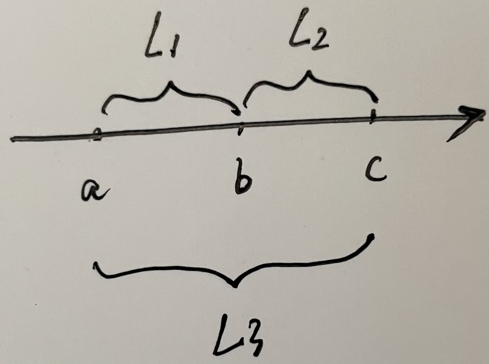

|      |        | Description                                                  |
| ---- | ------ | ------------------------------------------------------------ |
| 2    | 线性表 | 线性表的定义和基本操作<br />线性表的顺序表示<br />线性表的链式表示 |

1. 从顺序表中删除具有最小值的元素（假设唯一）并由函数返回被删元素的值。空出的位置由最后一个元素填补，若顺序表为空，则显示出错信息并退出运行。

   搜索整个顺序表，查找最小值元素并记住其位置，搜索结束后用最后一个元素填补空出的原最小值元素的位置。

   ```cpp
   bool Del_Min(SqList &L, ElemType &value)
   {
       //删除顺序表L中最小值的元素结点，并通过引用型参数value返回其值
       //若删除成功，则返回true，否则返回false
       if(L.length==0)
           return false;//表空，终止操作返回
       value=L.data[0];
       int pos=0;//假定0号元素值最小
       for(int i=1;i<L.length;i++)//循环，寻找具有最小值的元素
           if(L.data[i]<value)//让value记忆当前具有最小值的元素
           {
               value=L.data[i];
               pos=i;
           }
       L.data[pos]=L.data[L.length-1];//空出的位置由最后一个元素填补
       L.length--;
       return true;//此时，value即为最小值
   }
   ```

2. 设计一个高效算法，将顺序表L的所有元素逆置，要求算法的空间复杂度为O(1)。

   扫描顺序表L的前半部分元素，对于元素L.data\[i\](0<=i<L.length/2)，将其与后半部分的对应元素L.data[L.length-i-1]进行交换。

   ```cpp
   void Reverse(SqList &L)
   {
       ElemType temp;//辅助变量
       for(int i=0;i<L.length/2;i++)
       {
           temp=L.data[i];//交换L.data[i]与L.data[L.length-i-1]
           L.data[i]=L.data[L.length-i-1];
           L.data[L.length-i-1]=temp;
       }
   }
   ```

3. 对长度为n的顺序表L，编写一个时间复杂度为O(n)，空间复杂度为O(1)的算法，该算法删除顺序表中所有值为x的数据元素。

   解法1：用k记录顺序表L中不等于x的元素个数（即需要保存的元素个数），扫描时将不等于x的元素移动到下标k的位置，并更新k值。扫描结束后修改L的长度。

   ```cpp
   void del_x_1(SqList &L, ElemType x)
   {
       //实现删除顺序表L中所有值为x的数据元素
       int k=0,i;//记录不等于x的元素个数
       for(i=0;i<L.length;i++)
           if(L.data[i]!=x)
           {
               L.data[k]=L.data[i];
               k++;//不等于x的元素增1
           }
       L.length=k;//顺序表L的长度等于k
   }
   ```

   解法2：用k记录顺序表L中等于x的元素个数，一边扫描L，一边统计k，并将不等于x的元素前移k个位置。扫描结束后修改L的长度。

   ```cpp
   void del_x_2(SqList &L, ElemType x)
   {
       int k=0,i=0;//k记录值等于x的元素个数
       while(i<L.length)
       {
           if(L.data[i]==x)
               k++;
           else
               L.data[i-k]=L.data[i];//当前元素前移k个位置
           i++;
       }
       L.length=L.length-k//顺序表L的长度递减
   }
   ```

   解法3：设头、尾两个指针（i=1, j=n），从两端向中间移动，在遇到最左端值x的元素时，直接将最右端非x的元素左移至值为x的数据元素位置，直到两指针相遇。但这种方法会改变原来表中元素的相对位置。

4. 从顺序表中删除其值在给定值s和t之间（包含s和t，要求s<t）的所有元素，若s或t不合理或顺序表为空，则显示出错信息并退出运行。

   从前向后扫描顺序表L，用k记录值在s和t之间的元素个数（初始时k=0）。对于当前扫描的元素，若其值不在s和t之间，则前移k个位置；否则执行k++。由于每个不在s和t之间的元素仅移动一次，因此算法效率高。

   ```cpp
   bool Del_s_t(SqList &L, ElemType s, ElemType t)
   {
   	//删除顺序表L中值在给定值s和t（要求s<t）之间的所有元素
       int i,k=0;
       if(L.length==0||s>=t)
           return false;//线性表为空或s、t不合法，返回
       for(i=0;i<L.length;i++)
       {
           if(L.data[i]>=s&&L.data[i]<=t)
               k++;
           else
               L.data[i-k]=L.data[i];//当前元素前移k个位置
       }
       L.length-=k;//长度减小
       return true;    
   }
   ```

   也可从后向前扫描顺序表，每遇到一个值在s和t之间的元素，就删除该元素，其后的所有元素全部前移。但移动次数远大于前者，效率不够高。

5. 从有序顺序表中删除所有其值重复的元素，使表中所有元素的值均不同。

   因为是有序顺序表，所以值相同的元素一定在连续的位置上，用类似于直接插入排序的思想，初始时将第一个元素视为非重复的有序表。之后依次判断后面的元素是否与前面非重复有序表的最后一个元素相同，若相同，则继续向后判断，若不同，则插入前面的非重复有序表的最后，直至判断到表尾为止。

   ```cpp
   bool Delete_Same(SeqList& L)
   {
       if(L.length==0)
           return false;
       int i,j;//i存储第一个不相同的元素，j为工作指针
       for(i=0,j=1;j<L.length;j++)
           if(L.data[i]!=L.data[j])//查找下一个与上个元素值不同的元素
               L.data[++i]=L.data[j];//找到后，将元素前移
       L.length=i+1;
       return true;
   }
   ```

6. 将两个有序顺序表合并为一个新的有序顺序表，并由函数返回结果顺序表。

   首先，按顺序不断取下两个顺序表表头较小的结点存入新的顺序表中。然后，看哪个表还有剩余，将剩下的部分加到新的顺序表后面。

   ```cpp
   bool Merge(SeqList A, SeqList B, SeqList &C)
   {
       //将有序顺序表A与B合并为一个新的有序顺序表C
       if(A.length+B.length>C.maxSize)//大于顺序表的最大长度
       	return false;
       int i=0,j=0,k=0;
       while(i<A.length&&j<B.length)//循环，两两比较，小者存入结果表
       {
           if(A.data[i]<＝B.data[j])
               C.data[k++]=A.data[i++];
           else
               C.data[k++]=B.data[j++];
       }
       while(i<A.length)//还剩一个没有比较完的顺序表
           C.data[k++]=A.data[j++];
       while(j<B.length)
           C.data[k++]=B.data[j++];
       C.length=k;
       return true;    
   }
   ```

7. 已知在一维数组A[m+n]中依次存放两个线性表(a1,a2,a3,..,an)和(b1,b2,b3,...,bn)。编写一个函数，将数组中两个顺序表的位置互换，即将(b1,b2,b3,...,bn)放到(a1,a2,a3,..,an)的前面。

   首先将数组A[m+n]中的全部元素(a1,a2,a3,...,am,b1,b2,b3,...,bn)原地逆置为(bn,bn-1,bn-2,...,b1,am,am-1,am-2,...,a1)，然后对前n个元素和后m个元素分别使用逆置算法，即可得到(b1,b2,b3,...,bn,a1,a2,a3,...,am)，从而实现顺序表的位置互换。

   ```cpp
   typedef int DataType;
   void Reverse(DataType A[], int left, int right, int arraySize)
   {
       //逆转(aleft,aleft+1,aleft+2...,aright)为(aright, aright-1, ..., aleft)
       if(left>=right||right>=arraySize)
           return;
       int mid = (left+right)/2;
       for(int i=0;i<mid-left;i++)
       {
           DataType temp=A[left+i];
           A[left+i]=A[right-i];
           A[right-i]=temp;
       }
   }
   void Exchange(DataType A[], int m, int n, int arraySize)
   {
       //数组A[m+n]中，从0到m-1存放顺序表(a1,a2,a3,..,am)，从m到m+n-1存放顺序表(b1,b2,b3,...,bn)，算法将这两个表的位置互换
       Reverse(A,0,m+n-1,arraySize);
       Reverse(A,0,n-1,arraySize);
       Reverse(A,n,m+n-1,arraySize);
   }
   ```

8. 线性表(a1,a2,a3,...,an)中的元素递增有序且按顺序存储于计算机内。要求设计一个算法，完成用最少时间在表中查找数值为x的元素，若找到，则将其与后继元素位置相交换，若找不到，则将其插入表中并使表中元素仍递增有序。

   顺序存储的线性表递增有序，可以顺序查找，也可以折半查找。折半耗时低。

   ```cpp
   void SearchExchangeInsert(ElemType A[], ElemType x)
   {
       int low=0, high=n-1,mid;//low和high指向顺序表下界和上界的下标
       while(low<=high)
       {
           mid=(low+high)/2;//找中间位置
           if(A[mid]==x)break;//找到x，退出while循环
           else if(A[mid]<x)low=mid+1;//到中点mid的右半部去查
           else high=mid-1;//到中点mid的左半部去查
       }//下面两个if语句只会执行一个
       //若最后一个元素与x相等，则不存在与其后继交换的操作
       if(A[mid]==x&&mid!=n-1)
       {
           t=A[mid];
           A[mid]=A[mid+1];
           A[mid+1]=t;
       }
       if(low>high)//查找失败，插入数据元素x
       {
           for(i=n-1;i>high;i--)A[i+1]=A[i];//后移元素
           A[i+1]=x;//插入x
       }
   }
   ```

   也可写成三个函数：查找函数、交换后继函数和插入函数。

9. 给定三个序列A、B、C，长度均为n，且均为无重复元素的递增序列，请设计一个时间上尽可能高效的算法，逐行输出同时存在于这三个序列中的所有元素。例如，数组A为{1，2，3}，数组B为{2，3，4}，数组C为{-1，0，2}，则输出2。

   - 给出算法的基本设计思想。
   - 根据设计思想，采用C或C++语言描述算法，关键之处给出注释。
   - 说明你的算法的时间复杂度和空间复杂度。

   使用三个下标变量从小到大遍历数组。当三个下标变量指向的元素相等时，输出并向前推进指针，否则仅移动小于最大元素的下标变量，直到某个下标变量移出数组范围，即可停止。

   ```cpp
   void sameKey(int A[], int B[], int C[], int n)
   {
       int i=0,j=0,k=0;//定义三个工作指针
       while(i<n&&j<n&&k<n)//相同则输出，并集体后移
       {
           if(A[i]=B[j]&&B[j]==C[k])
           {
               printf("%d\n",A[i]);
               i++;j++;k++;
           }
           else
           {
               int maxNum=max(A[i],max(B[j],C[k]));
               if(A[i]<maxNum)i++;
               if(B[j]<maxNum)j++;
               if(C[k]<maxNum)k++;
           }
       }
   }
   ```

   每个指针移动的次数不超过n次，且每次循环至少有一个指针后移，所以时间复杂度为O(n)，算法只用到了常数个变量，空间复杂度为O(1)。

10. 设将n(n>1)个整数存放到一维数组R中。设计一个在时间和空间两方面都尽可能高效的算法。将R中保存的序列循环左移p(0<p<n)个位置，即将R中的数据由(X0,X1,...,Xn-1)变换为(Xp,Xp+1,...,Xn-1,X0,X1,...,Xp-1)。要求：

    - 给出算法的基本设计思想。
    - 根据设计思想，采用C或C++或Java语言描述算法，关键之处给出注释。
    - 说明你所设计算法的时间复杂度和空间复杂度。

    可将问题视为把数组ab转换成数组ba（a代表数组的前p个元素，b代表数组中余下的n-p个元素），先将a逆置得到a-1b，再将b逆置得到a-1b-1，最后将整个a-1b-1逆置得到（a-1b-1）-1=ba。设Reverse函数执行将数组逆置的操作，对abcdefgh向左循环移动3（p=3）个位置的过程如下：

    Reverse(0,p-1)得到cbadefgh;

    Reverse(p,n-1)得到cbahgfed;

    Reverse(0,n-1)得到defghabc。

    在Reverse中，两个参数分别表示数组中待转换元素的始末位置。

    ```cpp
    void Reverse(int R[], int from, int to)
    {
        int i, temp;
        for(i=0;i<(to-from+1)/2;i++)
        {
            temp=R[from+i];
            R[from+i]=R[to-i];
            R[to-i]=temp;
        }
    }
    void Converse(int R[], int n, int p)
    {
        Reverse(R, 0, p-1);
        Reverse(R, p, n-1);
        Reverse(R, 0, n-1);
    }
    ```

    上述算法中三个Reverse函数的时间复杂度分别为O(p/2)、O((n-p)/2)和O(n/2)，故所设计的算法的时间复杂度为O(n)，空间复杂度为O(1)。

    也可借助辅助数组来实现，创建大小为p的辅助数组S，将R中前p个整数依次暂存在S中，同时将R中后n-p个整数左移，然后将S中暂存的p个数依次放回到R中的后续单元。时间复杂度为O(n)，空间复杂度为O(p)。

11. 一个长度为L（L>=1）的升序序列为S，处在第[L/2]个位置的数称为S的中位数。例如，若序列S1=（11，13，15，17，19），则S1的中位数是15，两个序列的中位数是含它们所有元素的升序序列的中位数。例如，若S2=（2，4，6，8，20），则S1和S2的中位数是11。现在有两个等长升序序列A和B，试设计一个在时间和空间两方面都尽可能高效的算法，找出两个序列A和B的中位数。要求：

    - 给出算法的设计思想。
    - 根据设计思想，采用C或C++或Java语言描述算法，关键之处给出注释。
    - 说明你所设计算法的时间复杂度和空间复杂度。

    分别求两个升序序列A、B的中位数，设为a和b，求序列A、B的中位数过程如下：

    条件1：若a=b，则a或b即为所求中位数，算法结束。

    条件2：若a<b，则舍弃序列A中较小的一半，同时舍弃序列B中较大的一半，要求两次舍弃的长度相等。

    条件3：若a>b，则舍弃序列A中较大的一半，同时舍弃序列B中较小的一半，要求两次舍弃的长度相等。

    在保留的两个升序序列中，重复过程，直到两个序列中均只含一个元素时为止，较小者即为所求的中位数。

    ```cpp
    int M_Search(int A[], int B[], int n)
    {
        int s1,d1,m1,s2,d2,m2;
        s1=0;d1=n-1;
        s2=1;d2=n-1;
        while(s1!=d1||s2!=d2)
        {
            m1=(s1+d1)/2;
            m2=(s2+d2)/2;
            if(A[m1]==B[m2])
                return A[m1];//满足条件1
            if(A[m1]<B[m2])//满足条件2
            {
                if((s1+d1)%2==0)//若元素个数为奇数
                {
                    s1=m1;//舍弃A中间点以前的部分，且保留中间点
                    d2=m2;//舍弃B中间点以后的部分，且保留中间点
                }
                else//元素个数为偶数
                {
                	s1=m1+1;//舍弃A的前半部分
                    d2=m2;//舍弃B的后半部分
                }
            }
            else//满足条件3
            {
                if((s1+d1)%2==0)//若元素个数为奇数
                {
                    d1=m1;//舍弃A中间点以后的部分，且保留中间点
                    s2=m2;//舍弃B中间点以前的部分，且保留中间点
                }
                else//元素个数为偶数
                {
                    d1=m1;//舍弃A的后半部分
                    s2=m2+1;//舍弃B的前半部分
                }
            }
        }
        return A[s1]<B[s2]?A[s1]:B[s2];
    }
    ```

    算法的时间复杂度为O(log2n)，空间复杂度为O(1)。

    另解：对两个长度为n的升序序列A和B中的元素按从小到大的顺序依次访问，这里访问的含义只是比较序列中两个元素的大小，并不实现两个序列的合并，因此空间复杂度为O(1)。按照上述规则访问第n个元素时，这个元素即为两个序列A和B的中位数。

12. 已知一个整数序列A=(a0,a1,...,an-1)，其中0<=ai<n(0<=i<n)。若存在ap1=ap2=...=apm=x且m>n/2(0<=pk<n,1<=k<m)，则称x为A的主元素。例如A=（0，5，5，3，5，7，5，5），则5为主元素；又如A=（0，5，5，3，5，1，5，7），则A中没有主元素。假设A中的n个元素保存在一个一维数组中，请设计一个尽可能高效的算法，找出A的主元素。若存在主元素，则输出该元素；否则输出-1。要求：

    - 给出算法的基本设计思想
    - 根据设计思想，采用C或C++或Java语言描述算法，关键之处给出注释。
    - 说明你所设计算法的时间复杂度和空间复杂度。

    算法的策略是从前向后扫描数组元素，标记出一个可能成为主元素的元素Num。然后重新计数，确认Num是否是主元素。

    第一步：选取候选的主元素。依次扫描所给数组中的每个整数，将第一个遇到的整数Num保存到c中，记录Num的出现次数为1；若遇到的下一个整数仍等于Num，则计数+1，否则计数减1；当计数减到0时，将遇到的下一个整数保存到c中，计数重新记为1，开始新一轮计数，即从当前位置开始重复上述过程，直到扫描完全部数组元素。

    第二部：判断c中元素是否是真正的主元素。再次扫描该数组，统计c中元素出现的次数，若大于n/2，则为主元素；否则，序列中不存在主元素。

    ```cpp
    int Majority(int A[], int n)
    {
        int i,c,count=1;//c用来保存候选主元素，count用来计数
        c=A[0];//设置A[0]为候选主元素
        for(i=1;i<n;i++)//查找候选主元素
        	if(A[i]==c)
                count++;//对A中的候选主元素计数
            else
                if(count>0)//处理不是候选主元素的情况
                    count--;
            	else//更换候选主元素，重新计数
                {
                    c=A[i];
                    count=1;
                }
        if(count>0)
            for(i=count=0;i<n;i++)//统计候选主元素的实际出现次数
                if(A[i]==c)
                    count++;
        if(count>n/2)return c;//确认候选主元素
        else return -1;//不存在主元素
    }
    ```

    实现的程序的时间复杂度为O(n)，空间复杂度为O(1)。

13. 给定一个含n(n>=1)个整数的数组，请设计一个在时间上尽可能高效的算法，找出数组中未出现的最小正整数。例如，数组{-5，3，2，3}中未出现的最小正整数是1；数组{1，2，3}中未出现的最小正整数是4。要求：

    - 给出算法的设计思想
    - 根据设计思想，采用C或C++语言描述算法，关键之处给出注释。
    - 说明你所设计算法的时间复杂度和空间复杂度。

    要求在时间上尽可能高效，因此采用空间换时间的办法。分配一个用于标记的数组B[n]，用来记录A中是否出现了1~n中的正整数，B[0]对应正整数1，B[n-1]对应正整数n，初始化B中全部为0。由于A中含有n个整数，因此可能返回的值是1~n+1，当A中n个数恰好为1~n时返回n+1。当数组A中出现了小于或等于0或大于n的值时，会导致1~n出现空余位置，返回结果必然在1~n中，因此对于A中出现了小于或等于0或大于n的值，可以不采取任何操作。

    经过以上分析可以得出算法流程：从A[0]开始遍历A，若0<A[i]<=n，则令B[A[i]-1]=1;否则不做操作。对A遍历结束后，开始遍历数组B，若能查找到第一个满足B[i]==0的下标i，返回i+1即为结果，此时说明A中未出现的最小正整数在1和n之间。若B[i]全部不为0，返回i+1(跳出循环时i=n，i+1等于n+1)，此时说明A中未出现的最小正整数是n+1。

    ```cpp
    int findMissMin(int A[], int n)
    {
        int i, *B;//标记数组
        B=(int *)malloc(sizeof(int)*n);//分配空间
        memset(B,0,sizeof(int)*n);//赋初值为0
        for(i=0;i<n;i++)
            if(A[i]>0&&A[i]<=n)//若A[i]的值介于1~n，则标记数组B
                B[A[i]-1]=1;
        for(i=0;i<n;i++)//扫描数组B，找到目标值
            if(B[i]==0)break;
        return i+1;//返回结果
    }
    ```

    时间复杂度：遍历A一次，遍历B一次，两次循环内操作步骤为O(1)量级，因此时间复杂度为O(n)。空间复杂度：额外分配了B[n]，空间复杂度为O(n)。

14. 定义三元组(a,b,c)（a,b,c均为整数）的距离D=|a-b|+|b-c|+|c-a|。给定3个非空整数集合S1、S2、S3，按升序分别存储在3个数组中。请设计一个尽可能高效的算法，计算并输出所有可能的三元组(a,b,c)（a属于S1，b属于S2，c属于S3）中的最小距离。例如S1={-1,0,9}，S2={-25,-10,10,11}，S3={2,9,17,30,41}，则最小距离为2，相应的三元组为(9,19,9)。要求：

    - 给出算法的基本设计思想。
    - 根据设计思想，采用C语言或C++语言描述算法，关键之处给出注释。
    - 说明你所涉及算法的时间复杂度和空间复杂度。

    
    $$
    D=|a-b|+|b-c|+|c-a|\geq0\\
    假设a\leq b\leq c\\
    D=L_1+L_2+L_3=2L_3
    $$
    由D的表达式可知，事实上决定D大小的关键是a和c之间的距离，于是问题就可以简化为每次固定c找一个a，使得L3=|c-a|最小。
    
    第一步：使用Dmin记录所有已处理的三元组的最小距离，初值为一个足够大的整数。
    
    第二部：集合S1、S2和S3分别保存在数组A、B、C中。数组的下标变量i=j=k=0，当i<|S1|、j<|S2|且k<|S3|时（|S|表示集合S中的元素个数），循环执行下面的a到c
    
    a) 计算(A[i],B[j],C[k])的距离D；（计算D）
    
    b) 若D<Dmin，则Dmin=D；（更新D）
    
    c) 将A[i]、B[j]、C[k]中的最小值的下标+1；（对照分析：最小值为a，最大值为c，这里c不变而更新a，试图寻找更小的距离D）
    
    第三步：输出Dmin，结束。
    
    ```cpp
    #define INT_MAX 0x7fffffff
    int abs_(int a)//计算绝对值
    {
        if(a<0)return -a;
        else return a;
    }
    bool xls_min(int a, int b, int c)
    {
        //a是否是三个数中的最小值
        if(a<=b&&a<=c)return true;
        return false;
    }
    int findMinofTrip(int A[], int n, int B[], int m, int C[], int p)
    {
        //D_min用于记录三元组的最小距离，初值赋为INT_MAX
        int i=0,j=0,k=0,D_min=INT_MAX,D;
        while(i<n&&j<m&&k<p&&D_min>0)
        {
            D=abs_(A[i]-B[j])+abs_(B[j]-C[k])+abs_(C[k]-A[i]);//计算D
            if(D<D_min)D_min=D;//更新D
            if(xls_min(A[i],B[j],C[k]))i++;//更新a
            else if(xls_min(B[j],C[k],A[i]))j++;
            else k++;
        }
        return D_min;
    }
    ```
    
    设n=(|S1|+|S2|+|S3|)，时间复杂度为O(n)，空间复杂度为O(1)。
    
    ---
    
    1. 在带头结点的单链表L中，删除所有值为x的结点，并释放其空间，假设值为x的结点不唯一，试编写算法以实现上述操作。
    
       解法1：用p从头至尾扫描单链表，pre指向*p结点的前驱。若p所指结点的值为x，则删除，并让p移向下一个结点，否则让pre、p指针同步后移一个结点。本算法是在无需单链表中删除满足某种条件的所有结点，这里的条件是结点的值为x。实际上，这个条件是可以任意指定的，只要修改if条件即可。比如，我们要求删除介于mink和maxk之间的所有结点，则只需将if语句修改为if(p->data>mink&&p->data<maxk)。
    
       ```cpp
       void Del_X_1(Linklist &L, ElemType x)
       {
           LNode *p=L->next,*pre=L,*q;//置p和pre的初始值
           while(p!=NULL)
           {
               if(p->data==x)
               {
                   q=p;//q指向被删结点
                   p=p->next;
                   pre->next=p;//将*q结点从链表中断开
                   free(q);//释放*q结点的空间
               }
               else//否则，pre和p同步后移
               {
                   pre=p;
                   p=p->next;
               }
           }
       }
       ```
    
       解法2：采用尾插法建立单链表。用p指针扫描L的所有结点，当其值不为x时，将其链接到L之后，否则将其释放。
    
       ```cpp
       void Del_X_2(Linklist &L, ElemType x)
       {
           LNode *p=L->next,*r=L,*q;//r指向尾结点，其初值为头结点
           while(p!=NULL)
           {
               if(p->data!=x)//*p结点值不为x时将其链接到L尾部
               {
                   r->next=p;
                   r=p;
                   p=p->next;//继续扫描
               }
               else
               {
                   q=p;
                   p=p->next;//继续扫描
                   free(q);//释放空间
               }
           }
           r->next=NULL;//插入结束后置尾结点指针为NULL
       }
       ```
    
       上述两个算法扫描一遍链表，时间复杂度为O(n)，空间复杂度为O(1)。
    
    2. 试编写在带头结点的单链表L中删除一个最小值结点的高效算法（假设该结点唯一）。
    
       用p从头至尾扫描单链表，pre指向*p结点的前驱，用minp保存值最小的结点指针（初值为p），minpre指向\*minp结点的前驱（初值为pre）。一边扫描，一边比较，若p->data小于minp->data，则将p、pre分别赋值给minp、minpre。当p扫描完毕时，minp指向最小值结点，minpre指向最小值结点的前驱结点，再将minp所指结点删除即可。
    
       ```cpp
       LinkList Delete_Min(LinkList &L)
       {
           LNode *pre=L,*p=pre->next;//p为工作指针，pre指向其前驱
           LNode *minpre=pre,*minp=p;//保存最小值结点及其前驱
           while(p!=NULL)
           {
               if(p->data<minp->data)
               {
                   minp=p;//找到比之前找到的最小值结点更小的结点
                   minpre=pre;
               }
               pre=p;//继续扫描下一个结点
               p=p->next;
           }
           minpre->next=minp->next;//删除最小值结点
           free(minp);
           return L;
       }
       ```
    
       算法需要从头至尾扫描链表，时间复杂度为O(n)，空间复杂度为O(1)。
    
    3. 试编写算法将带头结点的单链表就地逆置，所谓“就地”是指辅助空间复杂度为O(1)。
    
       解法1：将头结点摘下，然后从第一结点开始，依次插入到头结点的后面（头插法建立单链表），直到最后一个结点为止，这样就实现了链表的逆置。
    
       ```cpp
       LinkList Reverse_1(LinkList L)
       {
           LNode *p,*r;//p为工作指针，r为p的后继，以防断链
           p=L->next;//从第一个元素结点开始
           L->next=NULL;//先将头结点L的next域置为NULL
           while(p!=NULL)//依次将元素结点摘下
           {
               r=p->next;//暂存p的后继
               p->next=L->next;//将p结点插入到头结点之后
               L->next=p;
               p=r;
           }
           return L;
       }
       ```
    
       解法2：假设pre，p和r指向三个相邻的结点。假设经过若干操作后，*pre之前的结点的指针都已调整完毕，它们的next都指向其原前驱结点。现在令\*p结点的next域指向\*pre结点，注意到一旦调整指针的指向，\*p的后继结点的链就会断开，为此需要用r来指向原\*p的后继结点。处理时需要注意两点：一是在处理第一结点时，应将其next域置为NULL，而不是指向头结点（因为它将作为新表的尾结点）；二是在处理完最后一个结点后，需要将头结点的指针指向它。
    
       ```cpp
       LinkList Reverse_2(LinkList L)
       {
           LNode *pre,*p=L->next,*r=p->next;
           p->next=NULL;//处理第一个结点
           while(r!=NULL)//r为空，则说明p为最后一个结点
           {
               pre=p;//依次继续遍历
               p=r;
               r=r->next;
               p->next=pre;//指针反转
           }
           L->next=p;//处理最后一个结点
           return L;
       }
       ```
    
       上述两个算法的时间复杂度为O(n)，空间复杂度为O(1)。
    
    4. 设在一个带表头结点的单链表中，所有结点的元素值无序，试编写一个函数，删除表中所有介于给定的两个值（作为函数参数给出）之间的元素（若存在）。
    
       因为链表是无序的，所以只能逐个结点进行检查，执行删除。
    
       ```cpp
       void RangeDelete(LinkList &L, int min, int max)
       {
           LNode *pr=L,*p=L->link;//p是检测指针，pr是其前驱
           while(p!=NULL)
               if(p->data>min&&p->data<max)//寻找到被删除结点，删除
               {
                   pr->link=p->link;
                   free(p);
                   p=pr->link;
               }
           	else//否则继续寻找被删结点
               {
                   pr=p;//
                   p=p->link;
               }
       }
       ```
    
    5. 给定两个单链表，试分析找出两个链表的公共结点的思想（不用写代码）。
    
       两个单链表有公共结点，即两个链表从某一结点开始，它们的next都指向同一结点。由于每个单链表结点只有一个next域，因此从第一个公共结点开始，之后的所有结点都是重合的，不可能再出现分叉。所以两个有公共结点而部分重合的单链表，拓扑形状看起来像Y，而不可能像X。
    
       问题简化：如何判断两个单向链表有没有公共结点？应注意到这样一个事实：若两个链表有一个公共结点，则该公共结点之后的所有结点都是重合的，即它们的最后一个结点必然是重合的。因此，我们判断两个链表是不是有重合的部分时，只需要分别遍历两个链表到最后一个结点。若两个尾结点是一样的，则说明它们有公共结点，否则两个链表没有公共结点。
    
       然而，上面的思路中，顺序遍历两个链表到尾结点时，并不能保证在两个链表上同时到达尾结点。这是因为两个链表长度不一定一样。但假设一个链表比另一个长k个结点。由于两个链表从第一个公共结点开始到链表的尾结点，这一部分是重合的，因此它们应该同时到达第一个公共的结点。
    
       根据这一思路，先要遍历两个链表得到它们的长度，并求出两个长度之差。在长的链表上先遍历长度之差个结点，再同步遍历两个链表，直到找到相同的结点，或者一直到链表结束。此时，该方法的时间复杂度为O(len1+len2)。
    
    6. 设C={a1,b1,a2,b2,...,an,bn}为线性表，采用带头结点的单链表存放，设计一个就地算法，将其拆分为两个线性表，使得A={a1,a2,...,an}，B={bn,...,b2,b1}。
    
       循环遍历链表C，采用尾插法将一个结点插入表A，这个结点为奇数号结点，这样建立的表A与原来的结点顺序相同；采用头插法将下一个结点插入表B，这个结点为偶数号结点，这样建立的表B与原来的结点顺序正好相反。
    
       ```cpp
       LinkList Split(LinkList &A)
       {
           LinkList B=(LinkList)malloc(sizeof(LNode));//创建B表表头
           B->next=NULL;//B表的初始化
           LNode *p=A->next,*q;//p为工作指针
           LNode *ra=A;//ra始终指向A的尾结点
           while(p!=NULL)
           {
               ra->next=p;
               ra=p;//将*p链到A的表尾
               p=p->next;
               if(p!=NULL)
               {
                   q=p->next;//头插后，*p将断链，因此用q记忆*p的后继
                   p->next=B->next;//将*p插入到B的前端
                   B->next=p;
                   p=q;
               }
           }
           ra->next=NULL;//A尾结点的next域置空
           return B;
       }
       ```
    
       需要注意的是，采用头插法插入结点后，*p的指针域已改变，若不设变量保存其后继结点，则会引起断链，从而导致算法出错。
    
    7. 在一个递增有序的单链表中，存在重复的元素。设计算法删除重复的元素，例如(7,10,10,21,30,42,42,42,51,70)将变为(7,10,21,30,42,51,70)。
    
       由于是有序表，因此所有相同值域的结点都是相邻的。用p扫描递增单链表L，若*p结点的值域等于其后继结点的值域，则删除后者，否则p移向下一个结点。
    
       ```cpp
       void Del_Same(LinkList &L)
       {
           LNode *p=L->next, *q;//p为扫描工作指针
           if(p==NULL)
               return;
           while(p->next!=NULL)
           {
               q=p->next;//q指向*p的后继结点
               if(p->data==q->data)//找到重复的值
               {
                   p->next=q->next;//释放*q结点
                   free(q);//释放相同元素值的结点
               }
               else
                   p=p->next;
           }
       }
       ```
    
       算法的时间复杂度为O(n)，空间复杂度为O(1)。
    
       也可采用尾插法，将头结点摘下，然后从第一结点开始，依次与已插入结点的链表的最后一个结点比较，若不等则直接插入，否则将当前遍历的结点删除并处理下一个结点，直到最后一个结点为止。
    
    8. 设A和B是两个单链表（带头结点），其中元素递增有序。设计一个算法从A和B中的公共元素产生单链表C，要求不破坏A、B的结点。
    
       若A、B都有序，可从第一个元素起依次比较A、B两表的元素，若元素值不等，则值小的指针往后移，若元素值相等，则创建一个值等于两结点的元素值的新结点，使用尾插法插入到新的链表中，并将两个原表指针后移一位，直到其中一个链表遍历到表尾。
    
       ```cpp
       void Get_Common(LinkList A, LinkList B)
       {
           LNode *p=A->next,*q=B->next,*r,*s;
           LinkList C=(LinkList)malloc(sizeof(LNode));//建立表C
           r=C;//r始终指向C的尾结点
           while(p!=NULL&&q!=NULL)//循环跳出条件
           {
               if(p->data<q->data)
                   p=p->next;//若A的当前元素较小，后移指针
               else if(p->data>q->data)
                   q=q->next;//若B的当前元素较小，后移指针
               else//找到公共元素结点
               {
                   s=(LNode*)malloc(sizeof(LNode));
                   s->data=p->data;//复制产生结点*s
                   r->next=s;//将*s链接到C上（尾插法）
                   r=s;
                   p=p->next;//表A和B继续向后扫描
                   q=q->next;
               }
           }
           r->next=NULL;//置C尾结点指针为空
       }
       ```
    
    9. 已知两个链表A和B分别表示两个集合，其元素递增排列。编制函数，求A与B的交集，并存放于A链表中。
    
       采用归并的思想，设置两个工作指针pa和pb，对两个链表进行归并扫描，只有同时出现在两集合中的元素才链接到结果表中且仅保留一个，其他的结点全部释放。当一个链表遍历完毕后，释放另一个表中剩下的全部结点。
    
       ```cpp
       LinkList Union(LinkList &la, LinkList &lb)
       {
           LNode *pa=la->next;//设工作指针分别为pa和pb
           LNode *pb=lb->next;
           LNode *u,*pc=la;//结果表中当前合并结点的前驱指针pc
           while(pa&&pb)
           {
               if(pa->data==pb->data)//交集并入结果表中
               {
                   pc->next=pa;//A中结点链接到结果表
                   pc=pa;
                   pa=pa->next;
                   u=pb;//B中结点释放
                   pb=pb->next;
                   free(u);
               }
               else if(pa->data<pb->data)//若A中当前结点值小于B中当前结点值
               {            
                   u=pa;
                   pa=pa->next;//后移指针
                   free(u);//释放A中当前结点
               }
               else//若B中当前结点值小于A中当前结点值
               {
                   u=pb;
                   pb=pb->next;//后移指针
                   free(u);//释放B中当前结点
               }
           }
           while(pa)//B已遍历完，A未完
           {
               u=pa;
               pa=pa->next;
               free(u);//释放A中剩余结点
           }
           while(pb)//A已遍历完，B未完
           {
               u=pb;
               pb=pb->next;
               free(u);//释放B中剩余结点
           }
           pc->next=NULL;//置结果链表尾指针为NULL
           free(lb);//释放B表的头结点
           return la;
       }
       ```
    
       该算法的时间复杂度为O(len1+len2)，空间复杂度为O(1)。
    
    10. 两个整数序列A=a1,a2,a3,...,am和B=b1,b2,b3,...,bn已经存入两个单链表中，设计一个算法，判断序列B是否是序列A的连续子序列（字符串模式匹配链式表示）。
    
        因为两个整数序列已存入两个链表中，操作从两个链表的第一个结点开始，若对应数据相等，则后移指针；若对应数据不等，则A链表从上次开始比较结点的后继开始，B链表仍从第一个结点开始比较，直到B链表到尾表示匹配成功。A链表到尾而B链表未到尾表示失败。操作中应记住A链表每次的开始结点，以便下次匹配时好从其后继开始。
    
        ```cpp
        int Pattern(LinkList A, LinkList B)
        {
            LNode *p=A;//p为A链表的工作指针，假定A和B均无头结点
            LNode *pre=p;//pre记住每趟比较中A链表的开始结点
            LNode *q=B;//q是B链表的工作指针
            while(p&&q)
                if(p->data==q->data)//结点值相同
                {
                    p=p->next;
                    q=q->next;
                }
                else
                {
                    pre=pre->next;
                    p=pre;//A链表新的开始比较结点
                    q=B;//q从链表第一个结点开始
                }
            if(q==NULL)//B已经比较结束
                return 1;//说明B是A的子序列
            else
                return 0;//B不是A的子序列
        }
        ```
    
    11. 
